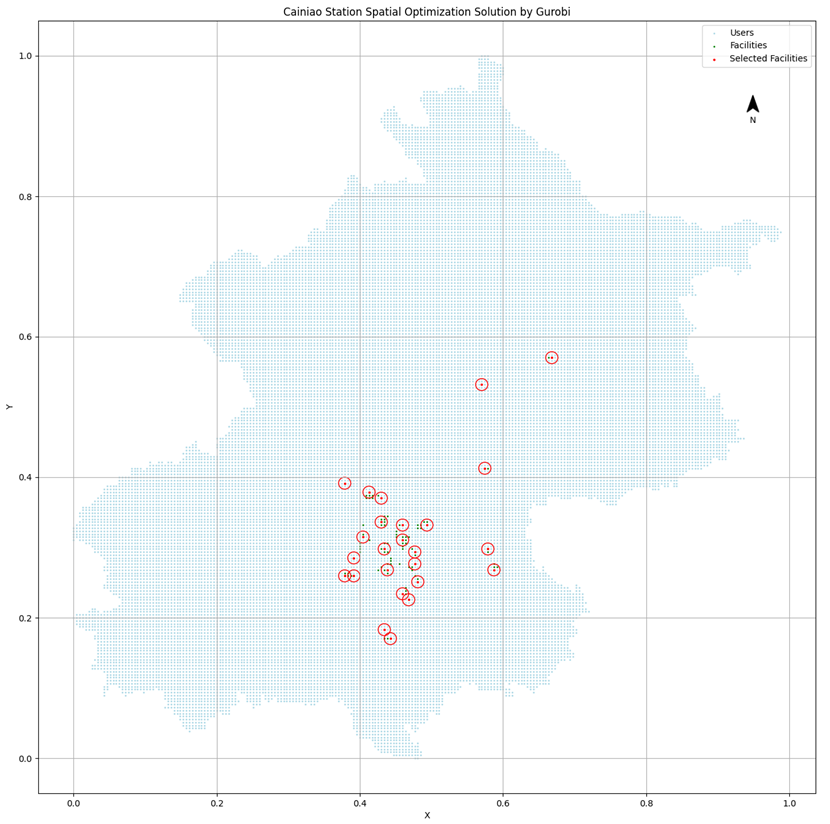

# Cainiao-Station-Location

  

---

In this project, we conducted data mining on Cainiao Station and various Points of Interest (POI) in Beijing, identifying the key influencing factors for Cainiao Station.Building upon the P-median, we utilized Gurobi solver to optimize the selection of Cainiao Station locations in Beijing. The optimization results can provide guidance for the site selection of Cainiao Station.

## Data Sources
POI points are the Autonavi map data captured by crawler programs, among which 1139 Beijing Cainiao station, 689 China Post stations, 346 colleges and universities, 1081 vegetable stores, 12853 residential areas, 28140 office buildings, 1484 scenic spots, 286 JD.com Express, 289 shopping centers, and 339 SF Express were obtained. The obtained POI attributes include information such as site name, type, specific address, latitude and longitude. After crawling all kinds of POIs in Beijing, it is necessary to clean all kinds of data, delete incomplete or nonmeeting requirements, and extract part of POI points for coordinate reverse lookup to verify the accuracy of crawling data.

In addition to POI data, this study also uses China's population distribution data in 2020, DEM data and China's road network data updated to May 23, 2023, which are obtained from the WorldPop website, NASA and OSM open source map datasets.

## Method
According to the influencing factors of the spatial distribution of Cainiao station, ten typical factors are selected to solve the optimal site selection of Beijing Cainiao station. Firstly, Beijing is divided into a square grid with a side length of 5 kilometers, and the values of the ten factors in the grid are calculated according to the grid statistics. The data of influencing factors are classified according to the natural break point classification method, which is convenient for Geodetector to analyze the correlation between the data. The quantity data of Cainiao station and the classification data of influence factors of each Cainiao station on each 5km grid were input into the Geodetector, and the output correlation q value was taken as the weight of each influence factor. Then, the influencing factors are counted based on the Beijing 1000m grid, and the statistical values are normalized. Combined with the weight of each influencing factor, the weighted sum of each 1000m grid is calculated as the rookie feasibility of the current grid. The rookie feasibility was arranged in descending order according to the value, and the geometric centers of the 3000 grids with the largest value were selected as the alternative points of Beijing Cainiao station. The DEM of Beijing population distribution was evaluated according to the 1 km grid identification points as the demand intensity. The alternative points and demand points of Cainiao station are input into the p-Median Problem, and the setting points of Cainiao station are selected according to the utility function value. The greater the utility value, the greater the influence of Cainiao station on the demand point.

## EXPERIMENTS AND ANALYSIS
### Overall spatial distribution characteristics
The population density of each district in Beijing gradually decreases from Dongcheng District and Xicheng District to the outer administrative districts, and the distribution number of Cainiao station presents a low-high-low distribution on the whole, with a small number of Dongcheng District, Xicheng District, Fangshan District and Fengtai District in the central urban area, and a large number of Cainiao station and China Post stations in the administrative districts in the middle area, such as: Changping District, Tongzhou District, Daxing District, Haidian District, Chaoyang District, Fangshan District, etc. The outermost boroughs have the least number of pick-up points.

  

### Spatial clustering characteristics
In order to explore the spatial aggregation characteristics of Beijing Cainiao station and post station, hot spot analysis tool was used to analyze the POI of Beijing Cainiao station and post office. It can be seen that both Cainiao station and postal express pick-up points have obvious spatial aggregation. The spatial distribution of Cainiao station shows a multicentric multicore aggregation model. The regions with higher values are mainly distributed in Changping District, Fangshan District and Tongzhou District, which are the most central administrative regions around Beijing, with dense population and not too high operating costs, suitable for Cainiao station operation. In China, the distribution of postal stations is concentrated, and the clustering areas are located in Dongcheng District and Xicheng district. Relying on the post office, the postal stations do not need to consider the economic problem of location selection, and the highest degree of aggregation is in the most densely populated place.

  
  

### Distribution statistics of distance between pick-up point and residential area
In order to explore the distribution of walking distance between Cainiao station, postal station and the nearest residential area, the tool of generating a neighbor table is used to find the three residential areas with the closest Euclideous distance for each Cainiao station and postal station, the lightweight route planning of Baidu Map API is used to obtain the residential area with the closest walking distance, and the distance distribution from the express pick-up point to the nearest residential area is calculated. In this study, the coordinates of the POI points of the residential area were selected as the location of the residential area for calculation.

The distribution of the number of express pick-up points from the nearest residential area shows a trend of increasing - decreasing - increasing, and the number of express pick-up points reaches the maximum when the distance reaches 200 meters. About 87.19% of Cainiao station is located within 1 km of the nearest residential area, and 87.97% of post offices are located within 1 km of the nearest residential area. The average distance from Cainiao station to the nearest residential area was 477.53 meters, while the average distance from postal stations to the nearest residential area was 1101.50 meters. Most express pick-up points larger than 1 km from the nearest residential area are located in the outermost rural areas of Beijing, and the distance between postal stations larger than 1 km and residential areas is much greater than that of Cainiao station.

  
  

###  Factors Influencing the Spatial Distribution of Bike-sharing
The spatial location distribution of Cainiao station is affected by many factors. On the whole, the spatial distribution of Cainiao station tends to converge towards the urban center. It is easy to consider that the spatial distribution of Cainiao station is affected by population density, regional economic conditions and surrounding ground objects. This study takes the spatial distribution of Cainiao station as the research object, and makes a quantitative analysis on the influence of various factors on the spatial distribution of Cainiao station.

The independent variables considered in the experiment are regional GDP, population density, road density, per capita disposable income, the number of colleges and universities, the number of vegetable shops, the number of residential areas, the number of office buildings, the number of scenic spots, the number of Jingdong express stations, the number of shopping centers, house prices, the number of SF Express stations, the number of ZTO stations, altitude and slope.

  

## Result
### Solved by Gurobi Solver
Gurobi solver is a powerful commercial mathematical solver with high performance solving algorithms and advanced mathematical optimization techniques, which can be used to solve various optimization problems such as linear programming, quadratic programming, and mixed integer programming. Limited by equipment conditions, it is impossible to solve the complete location optimization problem of Beijing Cainiao station. Only some data are selected as examples for solving. Below, 25 facility points are selected based on 28140 demand points and 100 alternative facility points.

  

